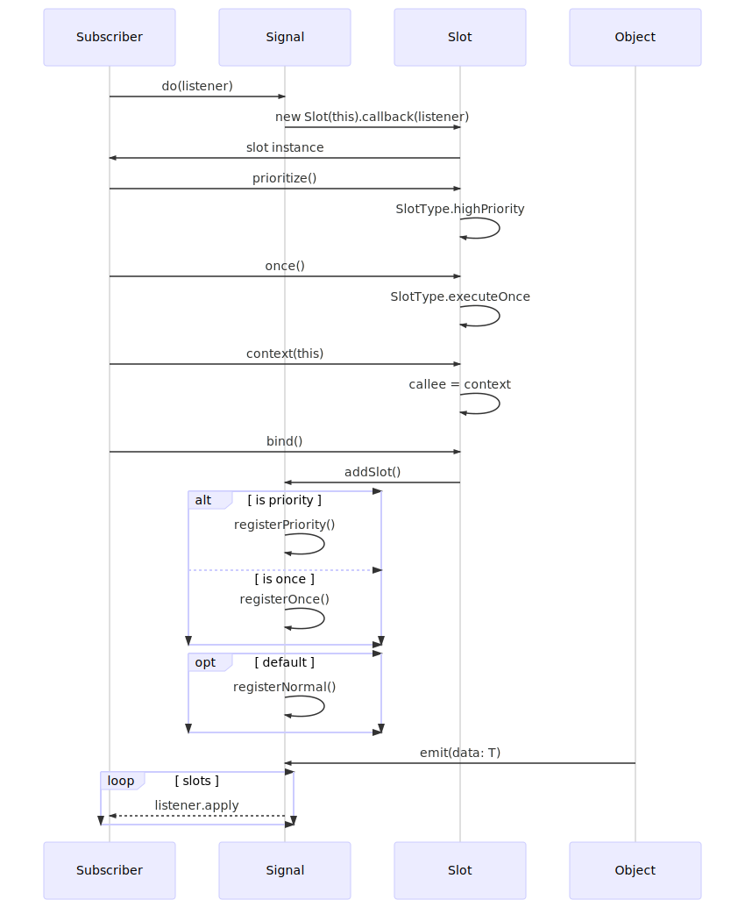

# Signal Slot

[Signals and Slots](https://en.wikipedia.org/wiki/Signals_and_slots) pattern written in Typescript.

# Installation

```
npm install signal-slot
```

# Usage

### Creating a Signal

Create an instance of Signal with the specified type, i.e, _string_, _number_, etc.

```typescript
import {Signal} from "signal-slot";

let onCompleted: Signal<number> = new Signal();
```

### Binding a function callback

Bind a simple callback with **do()** and **bind()**.

```typescript
onCompleted.do((n: number) => {
	console.log("got a number", n);
}).bind();
```

You can also **prioritize()** a callback.

```typescript
onCompleted.do((n: number) => {
	console.log("got a priority number", n);
}).prioritize().bind();
```

Or run the callback only **once()**.

```typescript
onCompleted.do((n: number) => {
	console.log("got a number once", n);
}).once().bind();
```

### Execution Context

Use the **context()** when a function should be called as a method of an object.

```typescript
onCompleted.do(this.methodHandler).context(this).bind();
```

### Emitting a Signal

```typescript
onCompleted.emit(299792458);
```

# Pro-Tips

### Organize your events in a module or namespace.

```typescript
export namespace Event {
	export const onLoaded: Signal<string> = new Signal();
	export const onCompleted: Signal<number> = new Signal();
}
```

### Bind to events in your constructor.

```typescript
class Subscriber {
	private message: string;
	constructor() {
		Event.onLoaded
			.do(this.loaded)
			.once()
			.context(this)
			.bind();
	}
	public loaded(message: string): void {
		this.message = message;
	}
}
```

### Remove a callback

```typescript
Event.onLoaded.unbind(this.callback);
```

## Sequence Diagram



# To-do

- Code comments and JsDoc

# License

[MIT License](https://raw.githubusercontent.com/rgr-myrg/signal-slot/master/LICENSE)
